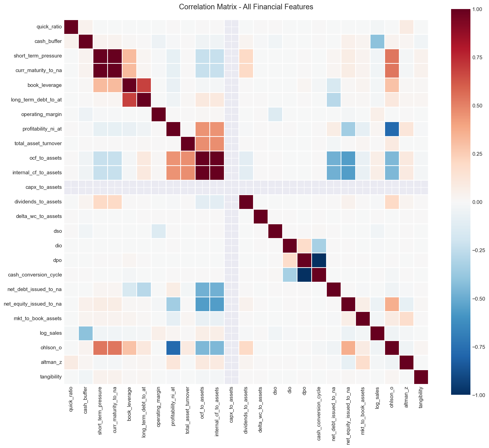
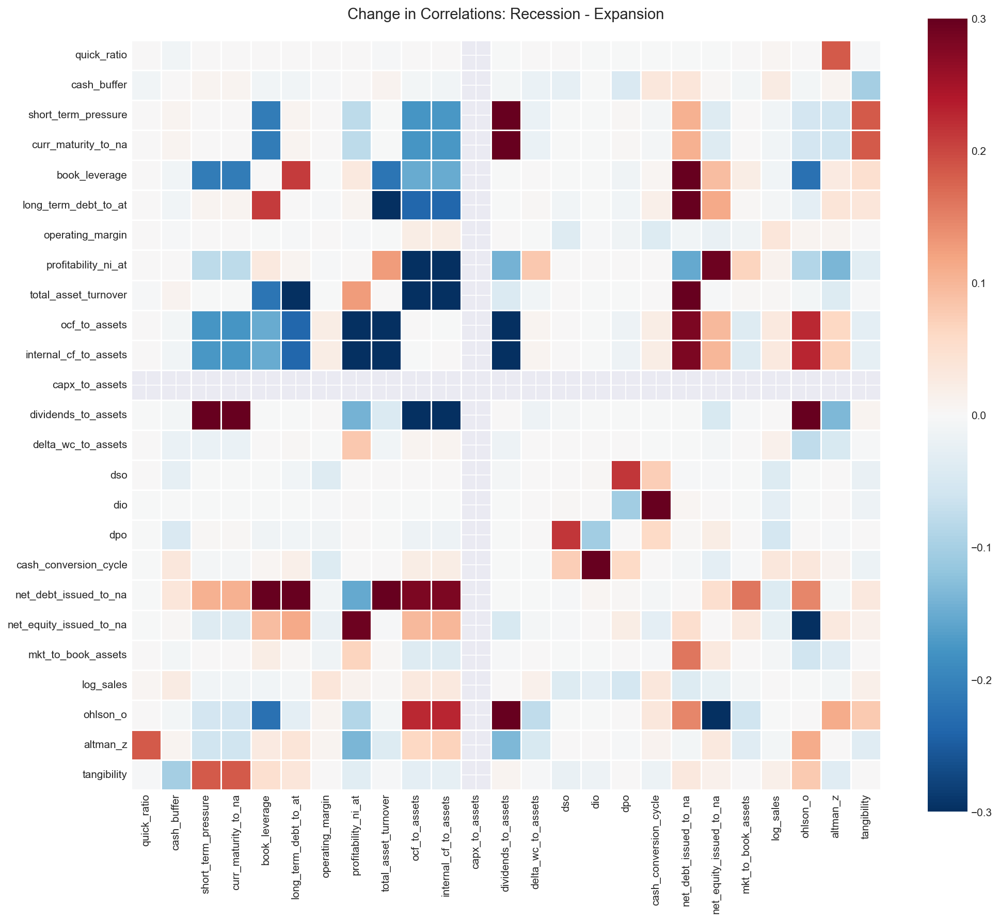
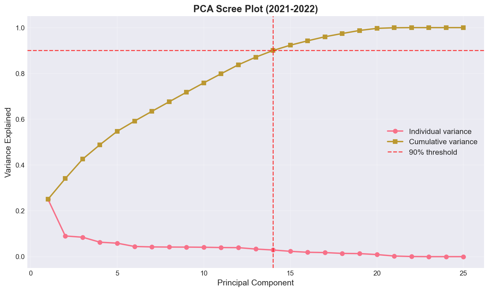
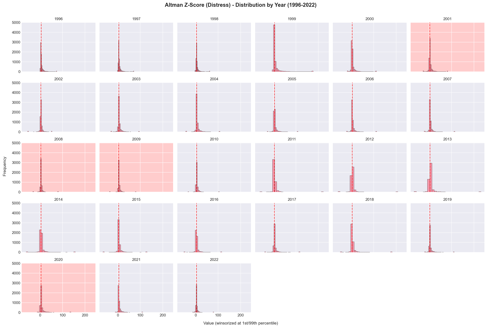
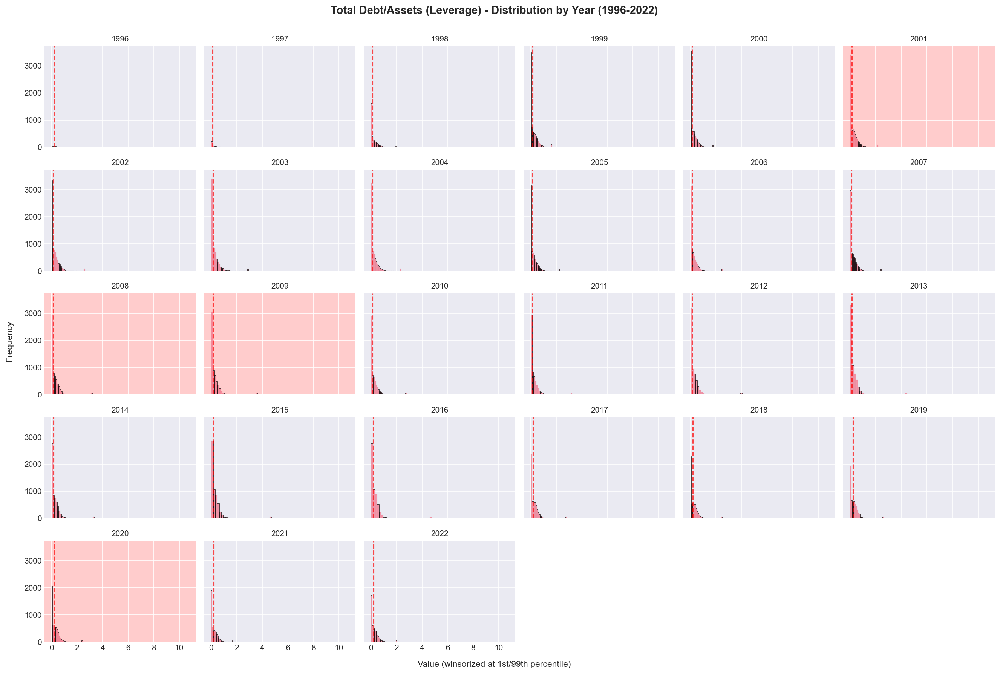
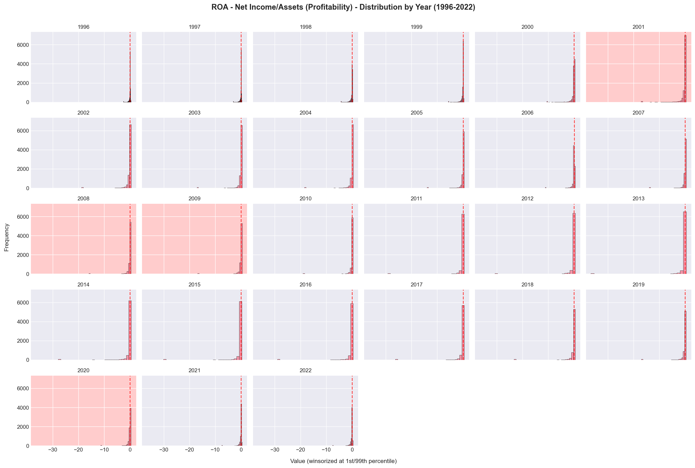
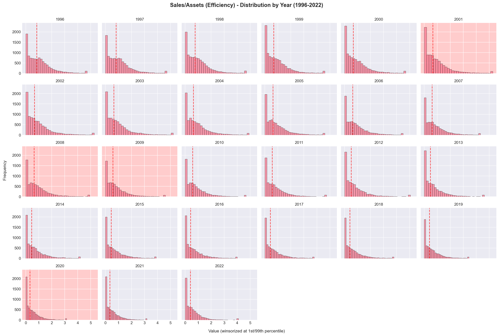

# Feature Engineering for Corporate Financial Analysis

**Author:** Emma Nagy  
**Date:** September 2025  
**Data Source:** COMPUSTAT Fundamentals Annual (1996-2022)

[](https://nbviewer.org/github/enagy827/feature-engineering/blob/main/AS3_Feature_Engineering_Portfolio.ipynb)
[](report/Portfolio_Project_3__Feature_Engineering_for_Corporate_Financial_Analysis.pdf)

---

## 📊 Project Overview

This project develops and validates a comprehensive set of financial statement features for corporate distress prediction using 27 years of COMPUSTAT data. Through systematic correlation analysis, temporal distributional assessment, and principal component analysis (PCA), 24 engineered financial ratios are shown to capture distinct but economically related signals suitable for bankruptcy prediction models.

## 🔍 Key Findings

1. **Regime-Dependent Correlations**: Financial relationships undergo substantial shifts during recessions, with correlation changes up to ±0.87. Asset turnover and operating cash flow correlations strengthen by +0.87 during downturns, while the normal positive relationship between efficiency and cash generation inverts (Δr = -0.78), validating the need for time-varying risk models.

2. **Cyclical Sensitivity**: Profitability (ROA) and distress (Altman Z-Score) distributions show clear crisis signatures aligned with NBER recessions (2001, 2008-09, 2020). The 2020 COVID recession exhibits a distinct V-shaped pattern (sharp shock, quick recovery) compared to the prolonged 2008-09 adjustment.

3. **Secular Trends**: Asset turnover declined from ~1.0 (late 1990s) to ~0.7 (2020s), reflecting structural shifts toward more capital-intensive business models. Leverage distributions remained remarkably stable over 27 years, suggesting fundamental capital structure decisions change slowly.

4. **Three Fundamental Dimensions**: PCA reveals interpretable latent factors that explain 43% of variance: Financial Distress (25% variance), Business Model Intensity (9%), and Growth/Liquidity (8%). These align precisely with financial theory's core dimensions of corporate analysis.

5. **Efficient Feature Set**: 14 of 24 components (58%) needed for 90% variance, indicating features are related but provide distinct information—ideal for comprehensive predictive modeling without excessive redundancy.

---

## 📁 Repository Contents

```
feature-engineering/
├── AS3_Feature_Engineering_Portfolio.ipynb      # Complete Jupyter notebook with analysis
├── outputs/
│   └── figures/                                 # Eight key visualizations (PNG)
│       ├── correlation_heatmap_full.png
│       ├── correlation_delta_recession.png
│       ├── pca_scree.png
│       ├── facets_altman_z.png
│       ├── facets_book_leverage.png
│       ├── facets_profitability_ni_at.png
│       ├── facets_quick_ratio.png
│       └── facets_total_asset_turnover.png
├── report/
│   └── Portfolio_Project_3__Feature_Engineering_for_Corporate_Financial_Analysis.pdf
├── requirements.txt                             # Python dependencies
└── README.md                                    # This file
```

---

## 📈 Visualizations

### 1. Correlation Structure

*Full correlation matrix for 24 financial features. Features cluster into expected groups: leverage, profitability, working capital, and valuation/distress. Despite some high correlations, most features provide distinct information.*

### 2. Regime-Dependent Correlations

*Change in correlations between recession and expansion periods (Δr = recession - expansion). Red indicates relationships that strengthen during recessions; blue indicates weakening. Asset turnover ↔ debt issuance shows largest increase (+0.87), while turnover ↔ cash flow inverts (-0.78).*

### 3. Principal Component Analysis

*PCA scree plot showing explained variance. PC1 captures 25% of variance (financial distress), PC2 captures 9% (business model), PC3 captures 8% (growth/liquidity). First three PCs explain 43% of total variance with clear economic interpretations. 14 components needed for 90% variance.*

### 4. Temporal Evolution - Altman Z-Score

*Altman Z-Score distribution by year (1996-2022). Right-skewed with visible leftward shifts during recessions (pink shading). Post-2008 distributions show increased dispersion, indicating greater heterogeneity in financial health.*

### 5. Temporal Evolution - Book Leverage

*Book leverage distribution by year (1996-2022). Remarkably stable distribution over 27 years, suggesting fundamental capital structure decisions change slowly. Slight median increase during 2008-09 reflects crisis-period stress.*

### 6. Temporal Evolution - Profitability (ROA)

*ROA distribution by year (1996-2022). Clear cyclicality with left shifts during recessions (2001, 2008-09, 2020) as more firms report losses. Post-2010 compression suggests reduced profitability dispersion across firms.*

### 7. Temporal Evolution - Quick Ratio

*Quick ratio distribution by year (1996-2022). Heavy right skew with consistent shape over time. Subtle rightward shift in 2020-2021 suggests COVID-era cash accumulation by firms.*

### 8. Temporal Evolution - Asset Turnover

*Asset turnover distribution by year (1996-2022). Clear secular decline from ~1.0 (late 1990s) to ~0.7 (2020s), indicating structural shift toward more capital-intensive business models. Recession periods show increased dispersion.*

---

## 🚀 How to Run This Analysis

### View Online (No Installation Required)

**[View the interactive notebook on nbviewer →](https://nbviewer.org/github/enagy827/feature-engineering/blob/main/AS3_Feature_Engineering_Portfolio.ipynb)**

### Run Locally

#### Prerequisites
- Python 3.8 or higher
- Jupyter Notebook or JupyterLab
- COMPUSTAT data access (institutional subscription required)

#### Option 1: Using Git

```bash
# Clone the repository
git clone https://github.com/enagy827/feature-engineering.git
cd feature-engineering

# Install dependencies
pip install -r requirements.txt

# Launch Jupyter
jupyter notebook

# Open AS3_Feature_Engineering_Portfolio.ipynb and run all cells
```

#### Option 2: Download ZIP

1. Click the green **"Code"** button at the top of this repository
2. Select **"Download ZIP"**
3. Extract the files to your desired location
4. Open terminal/command prompt and navigate to the extracted folder
5. Install dependencies: `pip install -r requirements.txt`
6. Launch Jupyter: `jupyter notebook`
7. Open `AS3_Feature_Engineering_Portfolio.ipynb` and run the cells

---

## 🛠️ Methodology

### Feature Engineering
24 financial ratios are constructed across five economically motivated categories:

**Liquidity (4 features):** Quick Ratio, Cash Buffer, Short-term Pressure, Current Maturity to Net Assets  
**Leverage (2 features):** Book Leverage, Long-term Debt to Assets  
**Profitability (3 features):** Operating Margin, ROA, Asset Turnover  
**Cash Flow (5 features):** OCF/Assets, Internal CF/Assets, CapEx/Assets, Dividends/Assets, ΔWC/Assets  
**Working Capital (4 features):** DSO, DIO, DPO, Cash Conversion Cycle  
**Financing (2 features):** Net Debt Issued, Net Equity Issued  
**Valuation (2 features):** Market-to-Book, Log(Sales)  
**Distress Scores (2 features):** Ohlson O-Score, Altman Z-Score

### Analytical Approach

**1. Qualitative Feature Selection**  
Features chosen based on established bankruptcy prediction literature and coverage of fundamental financial dimensions. Each feature justified by economic theory linking it to corporate distress.

**2. Quantitative Validation**  
- **Correlation analysis**: Pearson correlations computed to identify redundant features and validate expected relationships
- **Regime analysis**: Separate correlations for recession vs. expansion periods to test stability across economic conditions
- **Temporal analysis**: Yearly distributions (1996-2022) examined through faceted histograms with recession indicators

**3. Dimensionality Reduction**  
- **Feature scaling**: Log transformation for right-skewed features, followed by standardization (z-scores) for all features
- **PCA**: Applied to 2021-2022 data to identify latent factors and assess feature space dimensionality
- **Interpretation**: Top principal components analyzed for economic meaning and alignment with financial theory

### Data Processing
- **Sample**: 295,612 firm-year observations from COMPUSTAT (1996-2022)
- **Winsorization**: Distributions winsorized at 1st and 99th percentiles for visualization
- **Missing values**: Median-imputed before scaling to preserve sample size
- **Recession indicators**: NBER recession data from FRED aggregated to annual level

---

## 💻 Technologies Used

- **Python**: Core programming language
- **Pandas**: Data manipulation and analysis
- **NumPy**: Numerical computations
- **Matplotlib & Seaborn**: Statistical visualizations
- **Scikit-learn**: PCA, preprocessing pipelines, feature scaling
- **Jupyter**: Reproducible analysis environment
- **LaTeX**: Professional report generation

---

## 🎯 Key Insights

This analysis provides actionable insights for bankruptcy prediction modeling:

- **Time-varying models essential** — Correlations change by up to ±0.87 between recessions and expansions, invalidating static model assumptions. The normal positive relationship between operational efficiency and cash flow weakens or inverts during crises, precisely when prediction matters most.

- **Three fundamental dimensions** — Financial distress (leverage, cash flow, distress scores), business model intensity (capital intensity, turnover, scale), and growth/liquidity (cash holdings, market-to-book, size) explain 43% of variance with clear economic interpretations.

- **Crisis heterogeneity matters** — The 2020 COVID recession exhibits V-shaped dynamics (sharp shock, quick recovery) distinct from prolonged 2008-09 adjustment, suggesting crisis-specific features improve prediction accuracy.

- **Secular trends identified** — Asset turnover's 30% decline (1.0 → 0.7) reflects structural shift toward capital-intensive business models, while leverage stability indicates capital structure decisions are sticky.

- **Efficient feature set validated** — 14/24 components for 90% variance indicates ideal balance: features are related (some redundancy aids robustness) but provide distinct signals (58% retention preserves information).

### Implications

**For Model Development:** Retain all engineered features and allow modern ML algorithms (Random Forest, XGBoost) to determine relative importance through feature selection. Multicollinearity concerns are overstated for tree-based methods.

**For Risk Models:** Implement regime-switching approaches (separate models for recession/expansion) or include interaction terms with economic indicators. Static models systematically underestimate risk during the stress periods that matter most.

**For Ensemble Approaches:** Build sub-models focused on each principal component (distress model, business model, growth model) and combine predictions weighted by explanatory power (25%, 9%, 8%).

**For Monitoring:** Features with stable distributions (Quick Ratio, Leverage) provide reliable long-term signals, while cyclical features (ROA, Z-Score) offer early-warning signals during economic transitions.

---

## 📄 Technical Report

For detailed methodology, statistical analysis, comprehensive discussion, and full bibliography, see the complete technical report:

**[Download PDF Report →](report/Portfolio_Project_3__Feature_Engineering_for_Corporate_Financial_Analysis.pdf)**

---

## 📊 Data Source

**COMPUSTAT Fundamentals Annual**

- **Coverage**: 30,000+ U.S. public companies
- **Time Period**: 1996-2022 (27 years, 295,612 firm-year observations)
- **Variables**: Financial statement data (income statements, balance sheets, cash flow statements)
- **Source**: S&P Capital IQ (institutional subscription required)

COMPUSTAT provides standardized financial statement data used widely in academic research and industry for corporate financial analysis.

**NBER Recession Indicators (USREC)**

- **Coverage**: Monthly U.S. recession indicators
- **Time Period**: 1996-2022
- **Source**: Federal Reserve Economic Data (FRED)
- **URL**: https://fred.stlouisfed.org/series/USREC

---

## 📚 Project Context

This project was completed as part of academic coursework demonstrating proficiency in:
- Financial statement analysis and ratio construction
- Feature engineering for machine learning applications
- Regime-dependent statistical analysis
- Dimensionality reduction and interpretation
- Technical communication and visualization

The analysis addresses three key research questions:
1. Do financial ratios provide distinct information suitable for bankruptcy prediction?
2. How do financial relationships change during economic stress periods?
3. What are the fundamental dimensions of corporate financial variation?

---

## 🔗 Contact

For questions, collaboration opportunities, or to discuss this research:

- **Portfolio**: [emmanagy.net](https://www.emmanagy.net/)
- **LinkedIn**: [Emma Nagy](https://www.linkedin.com/in/emma-nagy/)

---

## 📝 Citation

If you use this analysis or methodology in your research, please cite:

```
Nagy, E. (2026). Feature Engineering for Corporate Financial Analysis: 
A Systematic Approach to Bankruptcy Prediction. 
Analysis of COMPUSTAT data (1996-2022) validating financial features for distress prediction.
https://github.com/enagy827/feature-engineering
```

---

## 📜 License

This project is available for educational and research purposes. Please credit appropriately if you use this work.

---

*Last updated: February 2026*
